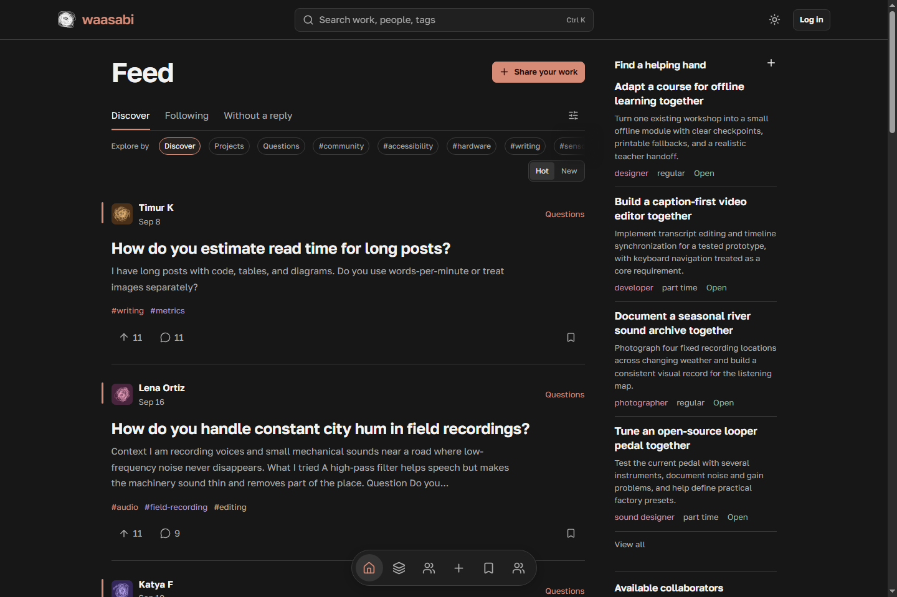
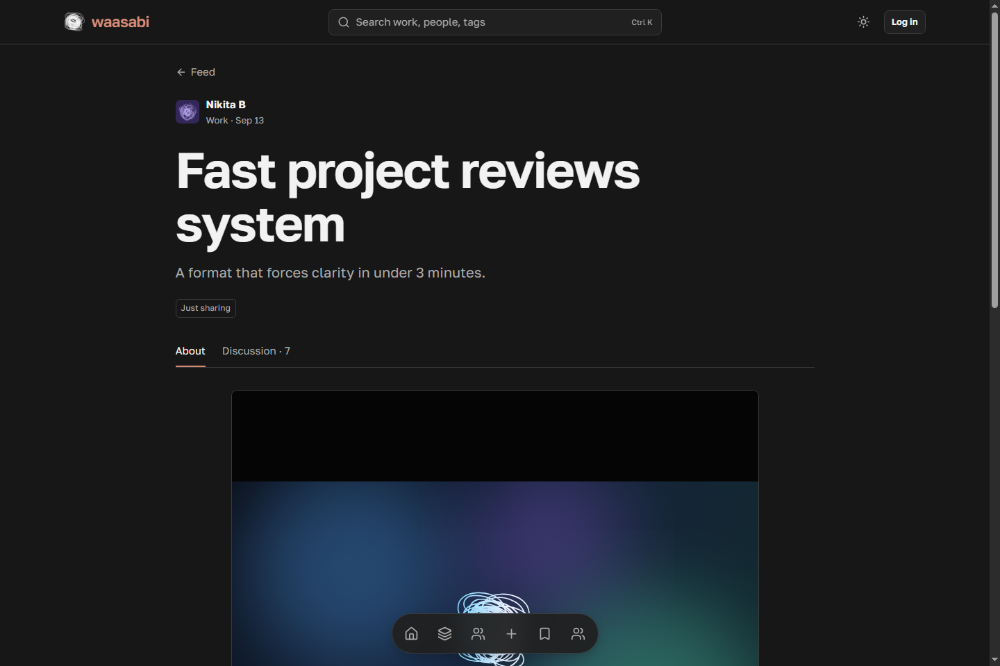
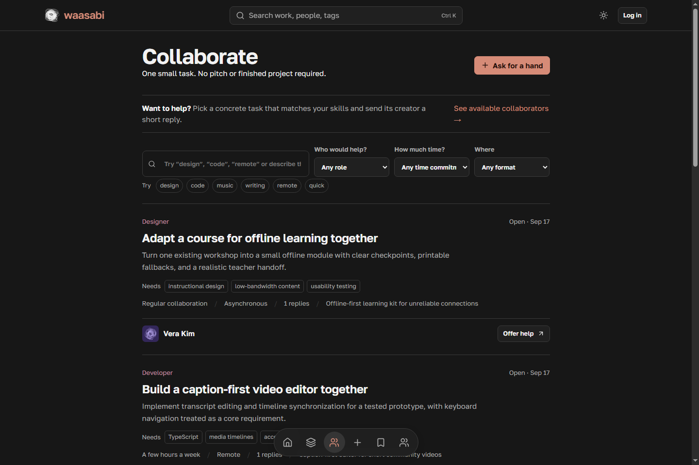
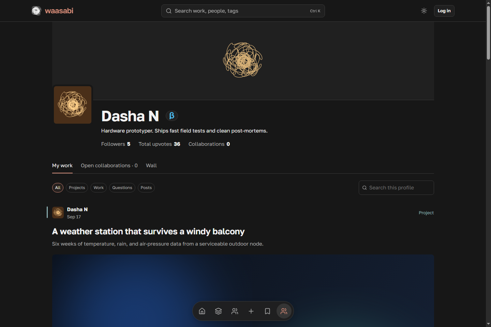

# Waasabi

Waasabi is a community for creative work, long-term projects, questions, and small collaborations. It continues The Hub through a full rebuild.

People can publish work, document a project, ask for feedback, and find collaborators. Each collaboration response opens a private conversation between the project owner and the candidate.



## Main features

- A discovery feed with tags, search, and hot and new sorting modes.
- Work and question pages with media, discussions, feedback, and answer voting.
- Project pages with journals, teams, followers, and open collaboration requests.
- Profiles with project showcases, statistics, posts, and collaboration history.
- Private collaboration threads for each response.
- Notifications, saved work, moderation tools, and role-based access.

## Screenshots

| Work | Collaborations | Profile |
| --- | --- | --- |
|  |  |  |

The [screenshot workflow](.github/workflows/screenshots.yml) rebuilds these images from seeded data after interface changes. Do not edit the PNG files manually.

## Stack

Waasabi uses Laravel 12, Inertia 3, React 19, TypeScript, Tiptap 3, and Vite. SQLite is the default local database.

## Local setup

Requirements: PHP 8.2 or later, Composer 2, Node.js 22, SQLite, and GD.

```bash
composer install
npm ci
cp .env.example .env
touch database/waasabi.sqlite
php artisan key:generate
php artisan migrate
php artisan storage:link
npm run build
php artisan serve
```

Run `php artisan db:seed --class=WaasabiDemoSeeder` to add local sample content.

## Checks

```bash
php artisan test
npm test
npm run build
composer audit
npm audit
```

See [deployment](docs/DEPLOYMENT.md), [architecture](docs/ARCHITECTURE.md), and [the rebuild notes](docs/WAASABI.md) for more information.

See [LICENSE](LICENSE) for the license terms.
