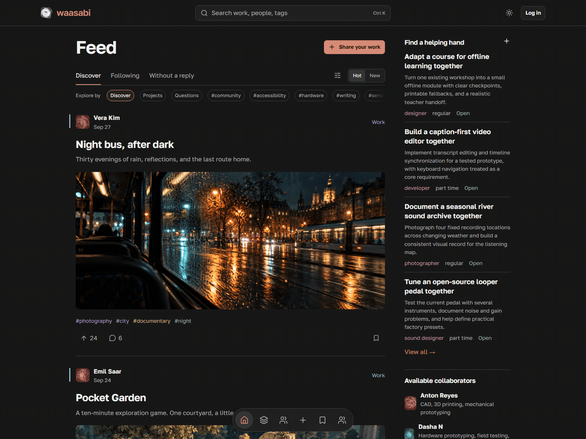
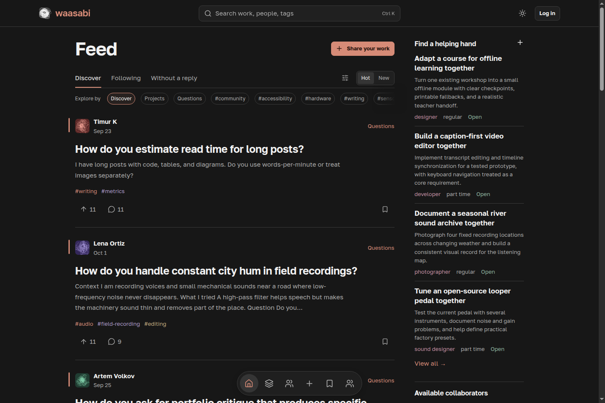
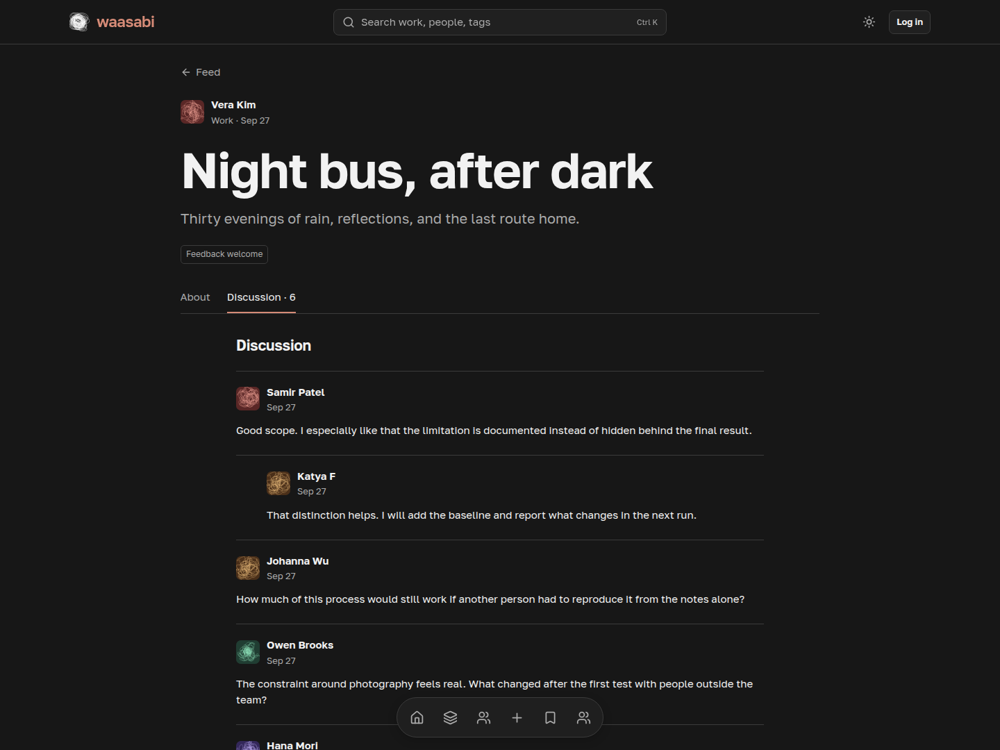
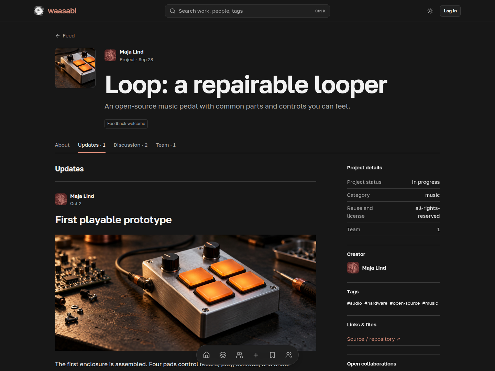
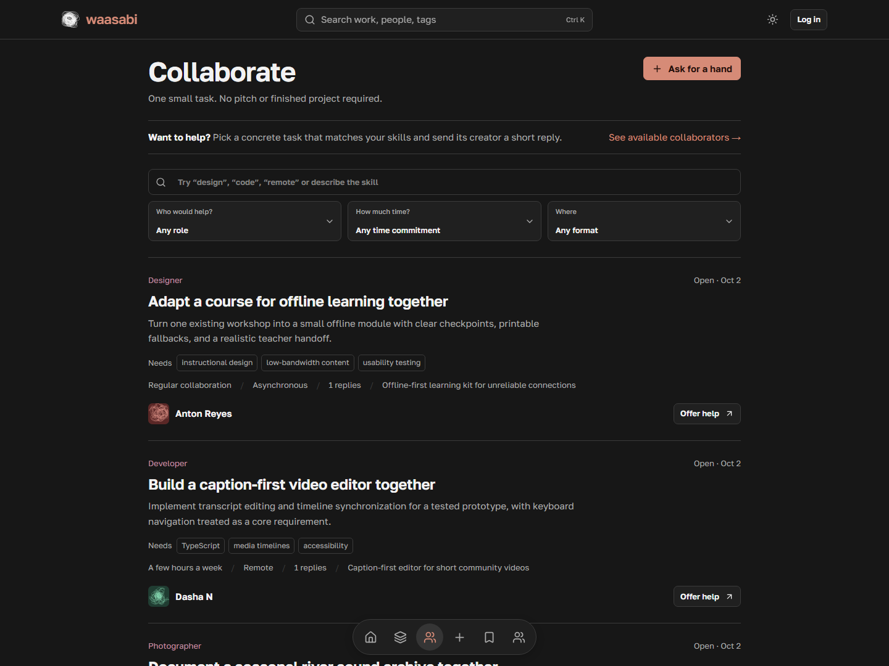
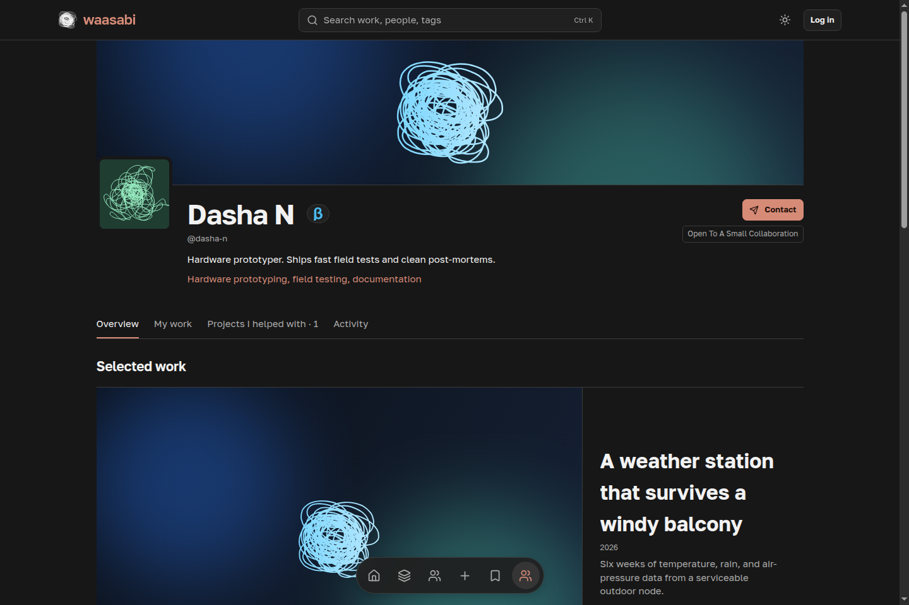

<p align="center">
  
</p>

<h1 align="center">Waasabi</h1>

<p align="center">
  <strong>Share your work. Keep a project journal. Find a helping hand.</strong>
</p>

<p align="center">
  <a href="#features">Features</a> ·
  <a href="#screenshots">Screenshots</a> ·
  <a href="#local-setup">Local setup</a> ·
  <a href="#checks">Checks</a> ·
  <a href="docs/README.md">Docs</a>
</p>

Waasabi is a community for people who build software, design interfaces, edit video, and make things together.
Publish a finished work, document a project, or ask a practical question. Keep the work and its discussion in one place.

## Features

- **Share work.** Publish text, images, galleries, files, and links. Ask for feedback or discuss the result.
- **Keep a project journal.** Add updates, invite a team, and let people follow your progress.
  Turn a standalone work into a project without changing its address or losing its discussion.
- **Ask questions.** Use answer voting and threaded replies to compare suggestions.
- **Find a helping hand.** Describe a concrete task and the time it needs. A collaboration request can exist separately or belong to a project.
  Each response opens a private conversation between the request author and the candidate.
- **Build a profile.** Show your work, feature a project, list your skills, and show your availability.
- **Discover and return.** Search work, people, and tags. Follow authors and projects, save work, and receive notifications.
- **Moderate the community.** Review reports, manage content and accounts, and control access through roles and permissions.

## Screenshots

Expand a view to see the full image.

<details>
<summary><strong>Feed · Photography, games, projects, and open requests</strong></summary>



</details>

<details>
<summary><strong>Work · Feedback, threaded replies, and comment sorting</strong></summary>



</details>

<details>
<summary><strong>Project · An ongoing build with updates and a team</strong></summary>



</details>

<details>
<summary><strong>Collaborations · Concrete tasks and people who can help</strong></summary>



</details>

<details>
<summary><strong>Profile · Work, projects, and contributions in one place</strong></summary>



</details>

The [screenshot workflow](.github/workflows/screenshots.yml) captures these views from a dedicated sample database after interface changes.
It also creates the GIF, with one second per view. The sample post covers use [generated artwork](docs/screenshots/artwork-prompts.md).

<details>
<summary><strong>Refresh the screenshots locally</strong></summary>

The capture script needs Chrome, FFmpeg, and a local server.
Create a separate SQLite database. Set `DB_DATABASE` to its absolute path before you run these commands:

```bash
php artisan migrate
php artisan db:seed --class=ReadmeScreenshotSeeder
php artisan serve --host=127.0.0.1 --port=8081
```

In another terminal, run `npm run screenshots`.
If the server uses another address, set `WAASABI_URL` before capture.

</details>

## Stack

| Part | Tools |
| --- | --- |
| Server | PHP 8.2+, Laravel 12, Eloquent |
| Interface | Inertia 3, React 19, TypeScript |
| Editor | Tiptap 3, Markdown |
| Assets | Vite |
| Local database | SQLite |

Laravel handles routes, validation, permissions, and data. React renders the main community pages through Inertia.
Blade serves support and selected administrative pages. Node.js builds the assets.

## Local setup

Install PHP 8.2 or later with PDO SQLite and GD, Composer 2, and Node.js 22.12 or later.
Run these commands from the repository root. The file commands work in PowerShell and Bash.

```bash
composer install
npm ci
php -r "file_exists('.env') || copy('.env.example', '.env');"
php -r "file_exists('database/waasabi.sqlite') || touch('database/waasabi.sqlite');"
php artisan key:generate
php artisan migrate
php artisan storage:link
npm run build
php artisan serve --host=127.0.0.1 --port=8081
```

Open **http://127.0.0.1:8081**.

For sample work, profiles, and collaboration requests, run this command in another terminal:

```bash
php artisan db:seed --class=WaasabiDemoSeeder
```

To create an administrator, run `php artisan admin:create owner@example.com`.
The command asks for a password.

For interface development, run `npm run dev` in another terminal.
On Windows, `./start.ps1` starts the local PHP server for an existing installation.

## Checks

```bash
php artisan test
php vendor/bin/pint --test
npm test
npm run build
composer audit
npm audit
```

`npm run build` checks TypeScript before it builds the assets.
PHP tests use a separate database.

## Documentation

- [Documentation index](docs/README.md) lists the project guides.
- [Architecture](docs/ARCHITECTURE.md) explains the runtime and security boundaries.
- [Codebase map](docs/CODEBASE_MAP.md) locates controllers, pages, models, and tests.
- [Code cleanliness](docs/CODE_CLEANLINESS.md) defines the maintenance conventions.
- [Maintenance plan](docs/MAINTENANCE_PLAN.md) lists recurring checks.
- [Deployment](docs/DEPLOYMENT.md) covers production configuration, the scheduler, backups, and release commands.

## License

Copyright © KristopherZlo. All rights reserved. See [LICENSE](LICENSE) for the terms.
